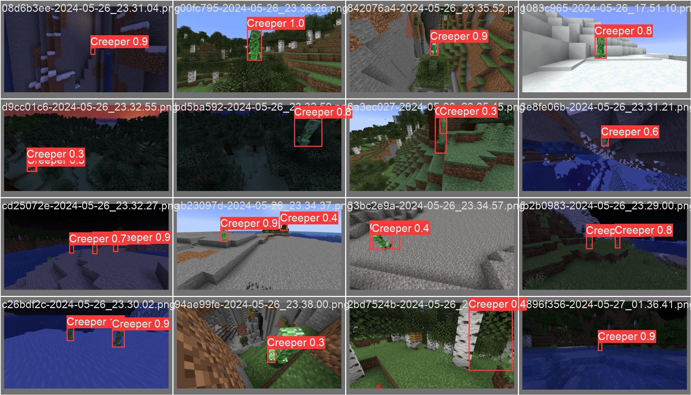

# 크리퍼 감지기 (Creeper_Detector)
\
게임 마인크래프트(Minecraft)의 화면에서 크리퍼(Creeper)를 인식하고,
크리퍼가 주변에 있으면 경고음을 울리며 예상 폭발 피해 범위를 표시해주는 프로그램입니다.

# 필요 환경
## Python
- `requirement.txt`에 기재되어 있습니다.

## Minecraft
- [Minecraft Java Edition 1.14-1.20.6](https://www.minecraft.net/)
    - 기본 리소스팩이 크게 변경된 1.13 이전 버전에서는 잘 작동하지 않을 수 있습니다.
- 권장 비디오 설정
    - 시야 범위 : 보통(70)
    - 밝기: 밝게
    - 화면비: 16 : 9
- **Minecraft를 소유하지 않은 경우**, `options.txt`의 `use_example = True`로 설정하여 프로그램을 가동해 볼 수 있습니다.

# 사용법 설명

## 실행 방법
`main.py`를 실행해 주세요.

## 감지
프로그램이 실행되면 자동으로 크리퍼를 감지하여, 예상 폭발 반경을 표시합니다.
- 빨간 원(3m): 크리퍼의 폭발 강도(3)을 고려했을 때, 흙 등 일반적인 블록이 파괴되는 범위입니다.
- 노란 원(7m): 크리퍼의 폭발에 엔티티가 피해를 입을 수 있는 최대 범위이며, 이 거리 밖으로 벗어날 경우 크리퍼가 자폭을 중지합니다.
    - 경고음이 나는 초기 기준도 이 거리로 설정되어 있습니다.

## 단축키
### Q
화면에 단축키에 대한 간단한 설명을 표시합니다.
### S
화면을 캡처하여 `screenshot` 폴더 아래에 저장합니다.
### F9
화면 녹화를 시작/종료하여 `screenshot` 폴더 아래에 저장합니다. 일반적으로 화면 처리 속도가 30fps를 넘기기 어렵습니다. (약 16fps@1080p @ Ryzen 5 3600, RTX 3070) 영상 자체는 초당 30프레임으로 저장되지만, 실제 영상은 그보다 거칠게 녹화될 수 있습니다.
### R
화면 크기를 현재 Minecraft 화면의 화면비에 맞게 조정합니다.
### ESC
프로그램을 종료합니다.

## 옵션 설정
옵션은 `options.txt`에 설명과 함께 각 항목이 기재되어 있습니다.

# 모델 설명
yolo 8.2버전의 yolov8s 모델을 기반으로 학습하였습니다.

## 사용 Dataset
어두운 곳이나 밝은 곳 등 여러 상황을 고려한 크리퍼 Dataset이 존재하지 않아, 직접 제작하였습니다. 
`datasets` 디렉토리 내에 있는 Dataset을 사용하였습니다.

### Dataset 정보
- 총 이미지 수: 320
- 크리퍼가 있는 이미지 : 없는 이미지 = 277 : 43
- 핫바가 있는 이미지 : 없는 이미지 = 288 : 32
- train : test = 256 : 64

## 성능 분석
### F1-Curve

### 예측 평가

### 그 외 결과
[이곳을 눌러 확인할 수 있습니다.](readme/model_results.csv)

## 추가 학습 방법
1. 원래 dataset을 포함하고 싶다면, `datasets/dataset.zip`을 `datasets` 아래에 압축 해제합니다.
2. `datasets/creeper/images` 아래에 추가 이미지를, `datasets/creeper/labels` 아래에 YOLO 형식에 맞게 추가 라벨을 저장합니다.
3. `training/train.py` 를 실행합니다.
4. 생성된 `runs/detect/train###/weights/best.pt`를 `resource/creeper_model.pt`에 위치시킵니다.

## 한계점
1. 크리퍼와 카메라의 거리 예측에 크리퍼의 크기를 기반으로 한 삼각비 추정을 사용합니다.
크리퍼의 거리에 이동 평균을 적용한 추가 보정을 고려하였으나, 이전 프레임과 다음 프레임에서 같은 크리퍼를 찾아야 해서 들어가지 않았습니다.
2. 크리퍼의 발밑에 폭발 반경을 그릴 때, Pose estimation 등의 기법을 사용하지 않고,
단순히 크리퍼의 가로-세로 비율로 각도를 추정해 일정 비율을 적용합니다.
크리퍼 머리를 이용해 Pose estimation을 적용하려 했으나, 인식률이 너무 낮아서 폐기하였습니다.

따라서, 이 두 계산은 두 값을 약간 보정하였음에도 불구하고 실제와 상당히 차이를 보입니다. **특히 폭발 반경은 오차가 더 큽니다.**

# 갤러리
## 작동 화면
\
단축키 호출(Q)와 화면 녹화(F9)를 사용한 상태
\
야간 크리퍼 탐지
\
다중 크리퍼 탐지

## 참고 자료
- [ChatGPT 4o](https://chatgpt.com), [Github Copilot](https://github.com/features/copilot)
- [YOLO Documentation](https://docs.ultralytics.com/ko)
    - ChatGPT가 yolov5를 기준으로 한 정보를 제공해서, yolov8로 migration하는 과정에 주로 참고
- [label-studio](https://github.com/HumanSignal/label-studio)
    - 데이터 라벨링에 사용
- https://github.com/orgs/ultralytics/discussions/7974
    - 모델 예측 결과 가져오기 코드 사용
- [mint-lab/3dv-tutorial](https://github.com/mint-lab/3dv_tutorial)
    - pose_estimation.py 대부분 사용
- [mint-lab/cv-tutorial](https://github.com/mint-lab/cv_tutorial)
    - video_converter.py 일부 화면 녹화, 재생 관련 코드 사용
- https://stackoverflow.com/questions/71233954/python-interpreter-locked-freezing-while-trying-to-run-pygetwindow-as-a-thread
    - 화면 캡처/녹화 스레드 구현에 일부 사용

# 라이선스
- datasets/dataset.zip의 이미지, resource/creeper_head.png, example_video.avi\
게임 'Minecraft'의 스크린샷으로, Mojang의 EULA를 따릅니다.
- resource/warn.wav\
Tin Hiệu 0 by SieuAmThanh -- https://freesound.org/s/608859/ -- License: Creative Commons 0
- resource/shutter.wav\
1/100 second camera shutter by FenrirFangs -- https://freesound.org/s/213180/ -- License: Creative Commons 0
- resource/NanumBarunGothic.ttf\
Copyright (c) 2010, NAVER Corporation (https://www.navercorp.com/) with Reserved Font NanumBarunGothic\
[라이선스 안내](https://help.naver.com/service/30016/contents/18088) 참고
